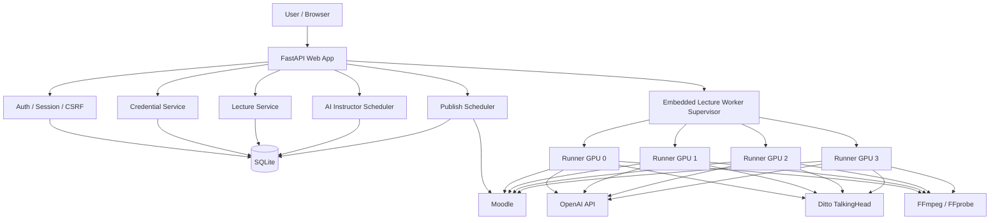
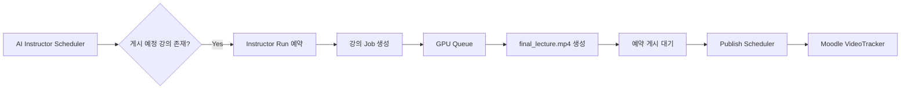

# AI Professor Lite

AI Professor Lite는 **강의 기획 → 슬라이드/이미지 생성 → 교수 설명 음성 생성 → Ditto TalkingHead 아바타 영상 생성 → 최종 강의 영상 합성 → Moodle VideoTracker 배포**를 하나의 웹 애플리케이션에서 처리하는 AI 기반 강의 제작 시스템입니다.

현재 애플리케이션 버전은 `0.4.3`이며, FastAPI 기반 웹 애플리케이션과 SQLite durable job queue, 멀티 GPU worker supervisor, OpenAI API, Ditto TalkingHead, FFmpeg, Moodle 연동으로 구성됩니다. 애플리케이션 코드의 버전 기준값은 `core/version.py`에서 관리합니다.

---

## 목차

- [주요 기능](#주요-기능)
- [전체 아키텍처](#전체-아키텍처)
- [강의 생성 파이프라인](#강의-생성-파이프라인)
- [AI Instructor](#ai-instructor)
- [멀티 GPU Worker](#멀티-gpu-worker)
- [작업 복구와 Checkpoint](#작업-복구와-checkpoint)
- [Ditto TalkingHead](#ditto-talkinghead)
- [교수 이미지 전처리](#교수-이미지-전처리)
- [슬라이드와 영상 합성](#슬라이드와-영상-합성)
- [Moodle 연동](#moodle-연동)
- [보안](#보안)
- [프로젝트 구조](#프로젝트-구조)
- [시스템 요구사항](#시스템-요구사항)
- [설치](#설치)
- [Ditto Checkpoint 설치](#ditto-checkpoint-설치)
- [환경변수](#환경변수)
- [실행](#실행)
- [Preflight](#preflight)
- [데이터와 산출물](#데이터와-산출물)
- [테스트](#테스트)
- [Troubleshooting](#troubleshooting)
- [운영 시 주의사항](#운영-시-주의사항)
- [Third-party / License](#third-party--license)

---

## 주요 기능

### 강의 자동 생성

- 강의 제목 및 주제 기반 AI 강의 설계
- 목표 강의시간 선택
  - 30분
  - 40분
  - 50분
  - 60분
- 슬라이드 수 선택
  - 8~12장
- 슬라이드별 핵심 bullet 생성
- 슬라이드별 교수 설명용 narration 생성
- 강의 내용 기반 4지선다 Quiz JSON 생성
- 선택적 AI 이미지 생성
- PowerPoint (`.pptx`) 생성
- 1920×1080 슬라이드 이미지 생성
- OpenAI TTS 기반 교수 설명 음성 생성
- Ditto TalkingHead 기반 교수 아바타 영상 생성
- FFmpeg 기반 최종 강의 영상 합성

### 사용자 / 계정

- 회원가입
- 로그인 / 로그아웃
- 사용자 프로필
- Argon2 비밀번호 해시
- Session 기반 인증
- CSRF 보호
- 로그인 요청 rate limit
- 사용자별 OpenAI API Key 저장
- 사용자별 Moodle URL / Web Service Token 저장
- 민감 credential의 Fernet 암호화 저장

### 강의 작업 관리

- SQLite 기반 durable job queue
- 기본 4개 GPU 병렬 처리
- GPU별 isolated runner process
- lease / heartbeat 기반 작업 소유권 관리
- retry / exponential backoff
- worker crash 복구
- 애플리케이션 재시작 후 작업 재개
- stage checkpoint 기반 이어서 실행
- 재시도 시 완료된 슬라이드 TTS 결과 재사용
- 이전 worker의 stale write 방지
- Ditto / FFmpeg child process group 종료 처리

### Moodle

- 사용자별 Moodle 연결정보 관리
- Moodle course 조회
- course section 조회
- VideoTracker 조회
- 기존 VideoTracker에 영상 연결
- 새 VideoTracker activity 생성
- MP4 업로드 및 VideoTracker 연결
- 예약 시각 Moodle 게시
- DNS 검증 및 IP pinning 기반 SSRF 방어

### AI Instructor

- 교수 아바타 설정
- 학기 시작일 / 학기 주차 설정
- 게시 요일 설정
- 게시 시간 설정
- 강의 생성 lead time 설정
- 주당 생성 횟수 제한
- 전체 또는 선택 Moodle course 대상 운영
- 강의 설계 지침 입력
- OpenAI 모델 / TTS voice 설정
- 강의 길이 / 슬라이드 수 설정
- 예약 시간 이전 자동 강의 생성
- 예약 시간 도달 후 Moodle 자동 게시

---

## 전체 아키텍처



FastAPI 애플리케이션이 시작되면 다음 구성요소가 함께 시작됩니다.

1. SQLite schema 초기화 / migration
2. Moodle 예약 게시 scheduler
3. AI Instructor scheduler
4. Embedded Lecture Worker Supervisor

따라서 일반적인 운영에서는 **웹 애플리케이션과 worker를 따로 실행하지 않습니다.**

---

## 강의 생성 파이프라인

강의 생성은 stage 단위로 실행되며 각 stage의 완료 상태와 산출물을 SQLite에 checkpoint로 저장합니다.

| Stage | Progress | 작업 |
|---|---:|---|
| `plan` | 10% | 강의 구성, narration, Quiz 생성 |
| `images` | 22% | 슬라이드용 AI 이미지 생성 |
| `slides` | 42% | PPTX 및 슬라이드 PNG 생성 |
| `narration` | 50% | 슬라이드별 TTS 및 전체 narration WAV 생성 |
| `timeline` | 65% | 슬라이드 영상 생성 |
| `avatar` | 73% | Ditto TalkingHead 영상 생성 |
| `compose` | 86% | 슬라이드 + 교수 아바타 + 음성 합성 |
| `deploy` | 96% | Moodle VideoTracker 배포 또는 예약 게시 연결 |

전체 흐름은 다음과 같습니다.

```text
강의 제목 / 주제 / 교수 사진
        │
        ▼
OpenAI 강의 계획 생성
        │
        ├── lecture_plan.json
        └── quiz.json
        │
        ▼
AI 이미지 생성
        │
        ▼
PPTX + 1920x1080 Slide PNG
        │
        ▼
OpenAI TTS
        │
        ├── slide_001.wav
        ├── slide_002.wav
        └── narration.wav
        │
        ▼
FFmpeg Slide Timeline
        │
        └── slides.mp4
        │
        ▼
교수 이미지 전처리
        │
        ▼
Ditto TalkingHead
        │
        └── avatar.mp4
        │
        ▼
FFmpeg Chroma Key + Overlay + Audio
        │
        └── final_lecture.mp4
        │
        ▼
Moodle VideoTracker
```

강의 계획은 JSON Schema로 검증하며, 선택한 슬라이드 수에 맞춰 정확한 개수의 slide를 생성하도록 요청합니다. Structured Output을 지원하지 않는 모델에서는 JSON-only fallback을 사용하되, API key 오류 등의 일반 오류를 structured-output 오류로 오인해 재호출하지 않도록 구분합니다.

---

## AI Instructor

AI Instructor는 학기 일정과 Moodle course 설정을 기준으로 강의를 자동 생성하고 예약 게시합니다.

예를 들어 다음과 같이 설정할 수 있습니다.

```text
학기 시작일: 2026-09-01
총 주차: 15주
게시 요일: 월 / 수
게시 시간: 18:00
Lead Time: 24시간
주당 생성 제한: 2회
대상 Course: 선택 Course
```

동작 흐름:



`lead_hours` 범위 안에 들어온 예정 강의를 미리 생성하며, 생성된 강의에 예약 게시 정보가 있으면 lecture worker가 Moodle에 즉시 업로드하지 않고 publish scheduler에 게시를 위임합니다.

기본 scheduler polling interval은 60초이며 `AI_INSTRUCTOR_POLL_SECONDS`로 조정할 수 있습니다.

---

## 멀티 GPU Worker

기본 설정은 4개 concurrent lecture job입니다.

```env
JOB_CONCURRENCY=4
JOB_GPU_IDS=0,1,2,3
```

Embedded supervisor는 각 GPU에 하나의 runner process를 할당합니다.

```text
FastAPI
  │
  └── Embedded Lecture Worker Supervisor
       ├── Runner #1 ── CUDA_VISIBLE_DEVICES=0
       ├── Runner #2 ── CUDA_VISIBLE_DEVICES=1
       ├── Runner #3 ── CUDA_VISIBLE_DEVICES=2
       └── Runner #4 ── CUDA_VISIBLE_DEVICES=3
```

각 runner에서 실행되는 Ditto / TensorRT / FFmpeg child process는 runner의 process group과 GPU 환경을 상속합니다.

`JOB_GPU_IDS`에는 다음 형식을 사용할 수 있습니다.

- CUDA index: `0,1,2,3`
- GPU UUID
- MIG UUID

동시 실행 수보다 GPU ID 수가 적으면 애플리케이션 시작 시 설정 오류가 발생합니다.

5번째 작업부터는 SQLite queue에서 GPU가 반환될 때까지 대기합니다.

### `worker.py`에 대하여

현재 `app.py`가 lecture supervisor를 **자동으로 embedded 실행**합니다.

따라서 정상 운영에서는 다음 하나만 실행합니다.

```bash
python app.py
```

`python worker.py`를 실행 중인 `app.py`와 동시에 실행하지 마십시오. 로컬 singleton lock이 중복 supervisor 실행을 막도록 구현되어 있습니다.

---

## 작업 복구와 Checkpoint

Lecture queue는 단순 메모리 queue가 아니라 SQLite에 작업 상태를 영속화합니다.

### Atomic Claim

작업 claim은 SQLite `BEGIN IMMEDIATE` transaction으로 직렬화하여 여러 runner가 같은 lecture를 동시에 가져가지 않도록 합니다.

### Lease / Heartbeat

실행 중 job은 lease token과 만료 시각을 가집니다.

```text
running job
  ├── lease_token
  ├── lease_until
  ├── worker_id
  └── gpu_id
```

worker는 heartbeat를 갱신하며, lease가 만료된 작업은 재시도 또는 실패 상태로 전환됩니다.

### `run_token`

lecture row에는 현재 실행권한을 가진 runner의 token이 기록됩니다. 이전 runner가 늦게 종료되더라도 새로운 runner가 만든 결과를 덮어쓰지 못하도록 stale update를 차단합니다.

### 애플리케이션 재시작

앱이 비정상 종료된 뒤 다시 시작되면 supervisor는:

1. singleton lock 획득
2. 이전 프로세스가 남긴 lecture runner 탐색
3. orphan runner process group 종료
4. unfinished `running` job을 `queued` 상태로 복구
5. interrupted attempt 횟수 환급
6. 완료된 stage checkpoint 검증
7. 첫 미완료 stage부터 재개

합니다.

완료된 파일이 삭제되거나 0 byte인 경우 checkpoint가 있어도 정상 완료로 취급하지 않습니다.

Narration 단계는 슬라이드별 TTS 결과를 강의 단위 content-addressed cache에 저장합니다. 같은 강의의 재시도에서는 model, voice, narration text가 동일한 이미 생성된 음성을 재사용하므로 중간 실패 뒤 앞 슬라이드의 TTS를 다시 호출하지 않습니다. run별 최종 산출물 디렉터리는 기존처럼 `run_token`으로 분리됩니다.

---

## Ditto TalkingHead

이 프로젝트는 Ant Group의 **Ditto: Motion-Space Diffusion for Controllable Realtime Talking Head Synthesis**를 교수 아바타 생성 엔진으로 사용합니다.

- Repository: <https://github.com/antgroup/ditto-talkinghead>
- Model: <https://huggingface.co/digital-avatar/ditto-talkinghead>
- Paper: <https://arxiv.org/abs/2411.19509>

현재 lecture pipeline의 기본 Ditto 설정은 다음과 같습니다.

```text
core/ditto-talkinghead/inference.py

checkpoints/ditto_trt_Ampere_Plus/

checkpoints/ditto_cfg/
└── v0.4_hubert_cfg_trt.pkl
```

기본 path는 환경변수로 변경할 수 있습니다.

```env
DITTO_ROOT=core/ditto-talkinghead
DITTO_DATA_ROOT=core/ditto-talkinghead/checkpoints/ditto_trt_Ampere_Plus
DITTO_CFG_PKL=core/ditto-talkinghead/checkpoints/ditto_cfg/v0.4_hubert_cfg_trt.pkl
```

애플리케이션과 Ditto의 Python environment를 분리하는 경우 `DITTO_PYTHON`을 지정합니다.

```env
DITTO_PYTHON=/opt/conda/envs/ditto/bin/python
```

runner가 GPU를 할당한 상태에서는 `CUDA_VISIBLE_DEVICES`가 worker에 의해 관리됩니다. `JOB_GPU_IDS`를 사용하는 일반 운영 환경에서는 `DITTO_GPU`를 별도로 지정하지 않는 것을 권장합니다.

---

## 교수 이미지 전처리

사용자가 업로드한 교수 이미지는 그대로 Ditto에 전달하지 않습니다.

### 업로드 검증

허용 포맷:

- PNG
- JPEG
- WebP

검증 내용:

- MIME과 실제 이미지 format 일치 확인
- 비정상 이미지 차단
- animated image 차단
- decompression bomb 방어
- 최대 file size 제한
- 최대 pixel 수 제한
- EXIF orientation 정규화
- metadata 제거
- 최종 PNG 재인코딩

### Avatar source 준비

입력 이미지는 상태에 따라 처리됩니다.

```text
일반 portrait
  → rembg
  → transparent foreground
  → chroma canvas
  → Ditto

투명 PNG
  → alpha 유지
  → chroma canvas
  → Ditto

기존 green/blue chroma 이미지
  → chroma 감지
  → Ditto
```

foreground 색상 특성을 고려해 green 또는 blue chroma를 선택할 수 있으며 최종 합성 단계에서 FFmpeg chromakey를 적용합니다.

기본 배경 제거 모델:

```env
REMBG_MODEL=u2net_human_seg
```

---

## 슬라이드와 영상 합성

### Slide

슬라이드는 1920×1080 기준으로 제작합니다.

생성 이미지의 aspect ratio가 슬라이드 영역과 다르더라도 이미지를 강제로 stretch하거나 무조건 crop하지 않고 다음 방식으로 배치합니다.

```text
원본 aspect ratio 유지
        ↓
contain
        ↓
center
```

동일한 정책을 PPTX와 영상용 slide PNG에 적용합니다.

### TTS

각 slide narration을 개별 WAV로 생성합니다.

```text
audio/
├── slide_001.wav
├── slide_002.wav
├── slide_003.wav
└── ...
```

이후 FFmpeg concat으로 전체 `narration.wav`를 생성합니다.

### FFmpeg

FFmpeg는 다음 작업을 담당합니다.

- slide image → 25fps video segment
- narration 길이에 맞춘 segment duration
- slide segment concat
- avatar chroma 제거
- avatar resize / overlay
- narration audio 결합
- 최종 MP4 생성
- FFprobe 기반 duration 검증

video encoder는 이름만 확인하지 않고 짧은 실제 encode test를 수행한 뒤 선택합니다.

현재 우선순위:

```text
libx264
  ↓
h264_nvenc
  ↓
libopenh264
  ↓
mpeg4
```

---

## Moodle 연동

사용자는 웹 UI에서 본인의 Moodle URL과 Web Service Token을 등록할 수 있습니다.

Credential lookup 우선순위는 다음과 같습니다.

1. SQLite에 암호화 저장된 사용자 credential
2. `.env`의 system-level Moodle credential

### VideoTracker 배포

새 VideoTracker activity를 생성하는 경우 Moodle 서버에 다음 custom external function이 필요합니다.

```text
mod_videotracker_create_activity
```

영상 파일 연결에는 다음 external function이 필요합니다.

```text
mod_videotracker_set_video
```

배포 과정:

```text
final_lecture.mp4
      │
      ▼
Moodle /webservice/upload.php
      │
      ▼
draftitemid
      │
      ▼
mod_videotracker_set_video
      │
      ▼
VideoTracker
```

새 activity 생성 모드에서는 먼저 `mod_videotracker_create_activity`를 호출해 CMID를 얻습니다.

비멱등적인 activity 생성 중 응답이 불명확한 경우 자동으로 같은 activity를 다시 생성하지 않고 작업을 중단하여 중복 생성 위험을 줄입니다.

### 예약 게시

AI Instructor가 미리 강의를 생성한 경우 `lecture_publish_schedules`에 예약 정보를 저장합니다.

Publish Scheduler는 예약 시간이 된 강의를 claim하여 Moodle에 업로드합니다.

기본값:

```env
LECTURE_PUBLISH_POLL_SECONDS=30
LECTURE_PUBLISH_MAX_ATTEMPTS=3
LECTURE_PUBLISH_RETRY_MINUTES=15
LECTURE_PUBLISH_TIMEZONE=Asia/Seoul
```

---

## Moodle URL 보안

Moodle 연결은 외부 URL을 서버가 직접 호출하므로 SSRF 방어 로직을 포함합니다.

실제 request 전에 다음을 수행합니다.

```text
URL parse / normalize
      ↓
허용 scheme 검사
      ↓
DNS resolve
      ↓
IP address 정책 검사
      ↓
검증한 IP로 connection pinning
      ↓
원래 Host header 유지
      ↓
HTTPS SNI hostname 유지
      ↓
redirect 차단
```

기본적으로 다음 주소는 허용하지 않습니다.

- loopback
- link-local
- multicast
- unspecified
- reserved network
- 허용되지 않은 private network

외부 Moodle은 HTTPS 사용을 기본으로 합니다.

특정 origin만 허용하려면:

```env
MOODLE_ALLOWED_ORIGINS=https://moodle.example.edu
```

내부 private network의 Moodle을 명시적으로 허용하려면 실제 request policy에 다음처럼 origin을 등록합니다.

```env
MOODLE_PRIVATE_ORIGINS=http://10.0.0.10:8080
```

Credential 저장 단계에서 내부 Moodle URL을 허용해야 하는 환경에서는:

```env
ALLOW_PRIVATE_MOODLE_URLS=1
```

을 함께 사용할 수 있습니다.

> 내부 Moodle 허용 설정은 신뢰할 수 있는 서버 환경에서만 사용하십시오.

---

## 보안

### Password

사용자 비밀번호는 Argon2로 hash합니다.

```text
Password
  ↓
Argon2
  ↓
password_hash
```

평문 password는 DB에 저장하지 않습니다.

### API Key / Token

OpenAI API Key 및 Moodle Token은 Fernet으로 암호화한 후 SQLite에 저장합니다.

```text
Credential
  ↓
Fernet(CREDENTIAL_MASTER_KEY)
  ↓
encrypted_secret
  ↓
SQLite
```

`CREDENTIAL_MASTER_KEY` 자체는 DB에 저장하지 않습니다.

### Session

`SESSION_SECRET`은 최소 32자의 임의 값이어야 합니다. 기본값이나 짧은 값이면 애플리케이션 시작을 중단합니다.

Production mode에서는 session cookie에 secure flag를 적용합니다.

```env
APP_ENV=production
```

### CSRF

상태 변경 form은 session에 저장된 CSRF token과 요청 token을 constant-time comparison으로 검증합니다.

### `.env`

`.env`에는 실제 API key, Moodle token, encryption key, session secret 등이 포함될 수 있습니다.

**절대로 `.env`를 Git 저장소, 배포 ZIP, 메신저 첨부파일 등에 포함하지 마십시오.**

배포 시 포함해야 하는 것은 실제 `.env`가 아니라 값이 제거된 `.env.example`입니다.

이미 외부로 전달된 secret은 파일을 삭제하는 것만으로 충분하지 않으며 해당 provider에서 폐기/rotation해야 합니다.

---

## 프로젝트 구조

```text
ai_prof_lite/
├── app.py
├── worker.py
├── .env.example
├── requirements.txt
├── requirements-dev.txt
├── requirements-full.txt
├── environment.yaml
├── conda-requirements.txt
│
├── core/
│   ├── config.py
│   ├── version.py
│   ├── body_limit.py
│   │
│   ├── database/
│   │   ├── client.py
│   │   ├── migrations.py
│   │   └── secrets.py
│   │
│   ├── jobs/
│   │   ├── base.py
│   │   ├── factory.py
│   │   ├── runner.py
│   │   └── sqlite.py
│   │
│   ├── moodle/
│   │   ├── client.py
│   │   ├── files.py
│   │   └── url_policy.py
│   │
│   ├── openai/
│   │   ├── client.py
│   │   ├── realtime.py
│   │   └── sessions.py
│   │
│   └── ditto-talkinghead/
│       ├── inference.py
│       ├── stream_pipeline_offline.py
│       ├── stream_pipeline_online.py
│       ├── core/
│       ├── scripts/
│       ├── example/
│       └── checkpoints/        # 별도 다운로드
│
├── modules/
│   ├── auth/
│   ├── credentials/
│   ├── dashboard/
│   ├── image/
│   ├── instructor/
│   ├── lecture/
│   ├── makeppt/
│   ├── moodle/
│   └── users/
│
├── templates/
│   ├── auth/
│   ├── dashboard/
│   ├── instructor/
│   ├── lectures/
│   ├── moodle/
│   └── settings/
│
├── scripts/
│   ├── preflight.py
│   ├── avatar_input_smoke.py
│   ├── chroma_smoke.py
│   └── resolve_deployment.py
│
├── tests/
│
└── data/                       # runtime data, Git 제외
```

---

## 시스템 요구사항

현재 worker 구현은 `fcntl`, process group, `/proc` 기반 orphan runner 정리를 사용하므로 **Linux 환경을 기준으로 합니다.**

권장 구성:

- Linux x86_64
- NVIDIA GPU
- NVIDIA Driver
- FFmpeg
- FFprobe
- Git LFS
- Application Python environment
- Ditto Python environment

### Application Python

루트 `requirements.txt`는 테스트된 Python 3.12 Linux runtime dependency를 lock한 파일입니다.

권장:

```text
Python 3.12
```

### Ditto Python

Ditto upstream의 공식 tested environment는 다음과 같습니다.

```text
Python 3.10
TensorRT 8.6.1
GPU A100
```

이 프로젝트에 포함된 `environment.yaml` 역시 Python 3.10 기반입니다.

따라서 애플리케이션과 Ditto environment를 분리하고 `DITTO_PYTHON`으로 Ditto interpreter를 지정하는 구성을 권장합니다.

### GPU

기본 checkpoint의 TensorRT engine은 `Ampere_Plus`입니다.

Ampere Plus engine과 호환되지 않는 GPU에서는 Ditto upstream의 ONNX → TensorRT 변환 script로 해당 GPU에 맞는 engine을 생성해야 합니다.

---

## 설치

### 1. 프로젝트 준비

```bash
git clone <YOUR_REPOSITORY_URL> ai_prof_lite
cd ai_prof_lite
```

ZIP으로 전달받았다면 압축을 해제한 뒤 프로젝트 root로 이동합니다.

### 2. 시스템 패키지

Ubuntu 계열 예시:

```bash
sudo apt update
sudo apt install -y ffmpeg git git-lfs
```

```bash
git lfs install
```

### 3. Application environment

```bash
python3.12 -m venv .venv
source .venv/bin/activate
python -m pip install --upgrade pip
python -m pip install -r requirements.txt
```

개발 / 테스트 환경:

```bash
python -m pip install -r requirements-dev.txt
```

### 4. Ditto environment

Miniconda / Miniforge가 설치되어 있다는 전제에서:

```bash
conda env create -f environment.yaml
conda activate ditto
```

환경 생성 과정에서 TensorRT package 설치가 현재 시스템과 충돌하는 경우 [Troubleshooting](#troubleshooting)을 참고하십시오.

---

## Ditto Checkpoint 설치

Ditto checkpoint는 애플리케이션 소스와 별도로 다운로드합니다.

```bash
cd core/ditto-talkinghead

git lfs install
git clone https://huggingface.co/digital-avatar/ditto-talkinghead checkpoints
```

기본적으로 다음 파일이 필요합니다.

```text
core/ditto-talkinghead/checkpoints/
├── ditto_cfg/
│   ├── v0.4_hubert_cfg_trt.pkl
│   └── v0.4_hubert_cfg_trt_online.pkl
│
├── ditto_onnx/
│   └── ...
│
├── ditto_pytorch/
│   └── ...
│
└── ditto_trt_Ampere_Plus/
    ├── appearance_extractor_fp16.engine
    ├── blaze_face_fp16.engine
    ├── decoder_fp16.engine
    ├── face_mesh_fp16.engine
    ├── hubert_fp32.engine
    ├── insightface_det_fp16.engine
    ├── landmark106_fp16.engine
    ├── landmark203_fp16.engine
    ├── lmdm_v0.4_hubert_fp32.engine
    ├── motion_extractor_fp32.engine
    ├── stitch_network_fp16.engine
    └── warp_network_fp16.engine
```

호환되지 않는 GPU에서 custom TensorRT engine을 만드는 방법은 Ditto upstream 문서를 기준으로 합니다.

예:

```bash
cd core/ditto-talkinghead

python scripts/cvt_onnx_to_trt.py \
  --onnx_dir ./checkpoints/ditto_onnx \
  --trt_dir ./checkpoints/ditto_trt_custom
```

이후:

```env
DITTO_DATA_ROOT=core/ditto-talkinghead/checkpoints/ditto_trt_custom
```

으로 변경합니다.

---

## 환경변수

`.env.example`을 복사해서 `.env`를 생성합니다.

```bash
cp .env.example .env
```

### 필수 Secret

#### `SESSION_SECRET`

최소 32자의 random secret을 사용합니다.

예:

```bash
python -c 'import secrets; print(secrets.token_urlsafe(48))'
```

```env
SESSION_SECRET=<generated-secret>
```

#### `CREDENTIAL_MASTER_KEY`

Fernet key를 생성합니다.

```bash
python - <<'PY'
from cryptography.fernet import Fernet
print(Fernet.generate_key().decode())
PY
```

```env
CREDENTIAL_MASTER_KEY=<generated-fernet-key>
```

이 key가 변경되면 기존 DB에 저장된 암호화 credential을 복호화할 수 없습니다. 운영 환경에서는 반드시 안전하게 백업하십시오.

### Application

```env
APP_ENV=development
APP_HOST=0.0.0.0
APP_PORT=8001
APP_RELOAD=0

DATA_DIR=data
DATABASE_PATH=./data/ai_prof_lite.db
TRUSTED_HOSTS=example.com,www.example.com
LECTURE_ORPHAN_RUN_RETENTION_HOURS=24
```

`APP_ENV=production`에서는 Secure session cookie와 HSTS가 활성화됩니다. `TRUSTED_HOSTS`를 설정하면 Host header도 허용 목록으로 제한합니다.

### OpenAI

OpenAI 기능은 **사용자가 UI에 등록한 본인 API key만** 사용합니다. 서버의 `OPENAI_API_KEY`로 대체하지 않습니다. Key가 없으면 강의 생성/AI 강사 기능을 시작할 수 없습니다.

```env
OPENAI_TIMEOUT_SECONDS=120

LECTURE_TEXT_MODEL=gpt-5.1
LECTURE_IMAGE_MODEL=gpt-image-2
LECTURE_TTS_MODEL=gpt-4o-mini-tts
LECTURE_TTS_VOICE=alloy
```

기본 lecture format:

```env
LECTURE_TARGET_DURATION_MINUTES=40
LECTURE_TARGET_SLIDE_COUNT=10
LECTURE_RENDER_SLIDES_WITH_IMAGE_MODEL=true
```

이미지 생성을 끄면 Image API를 호출하지 않고 로컬에서 텍스트 중심 슬라이드를 렌더링합니다. 이미지 생성이 켜져 있고 위 옵션도 `true`일 때만 전체 슬라이드 Image API 렌더링을 사용합니다.

### GPU / Queue

```env
JOB_CONCURRENCY=4
JOB_GPU_IDS=0,1,2,3

JOB_POLL_SECONDS=2
JOB_HEARTBEAT_SECONDS=10
JOB_LEASE_SECONDS=60
JOB_TIMEOUT_SECONDS=7200
JOB_MAX_ATTEMPTS=3
JOB_RETRY_SECONDS=10
```

### Ditto

```env
DITTO_ROOT=core/ditto-talkinghead
DITTO_DATA_ROOT=core/ditto-talkinghead/checkpoints/ditto_trt_Ampere_Plus
DITTO_CFG_PKL=core/ditto-talkinghead/checkpoints/ditto_cfg/v0.4_hubert_cfg_trt.pkl
DITTO_PYTHON=/opt/conda/envs/ditto/bin/python
```

멀티 GPU worker 환경에서는 일반적으로 `DITTO_GPU`를 비워 둡니다.

```env
# DITTO_GPU=
```

### Avatar

```env
AVATAR_INPUT_MODE=auto
AVATAR_CHROMA_COLOR=auto
AVATAR_CHROMA_SIMILARITY=0.12
AVATAR_CHROMA_BLEND=0.06
BACKGROUND_REMOVAL_REQUIRED=true
REMBG_MODEL=u2net_human_seg
```

Lecture portrait upload limit:

```env
MAX_PORTRAIT_BYTES=10485760
MAX_PORTRAIT_PIXELS=16000000
```

AI Instructor avatar에는 다음 설정도 사용할 수 있습니다.

```env
PORTRAIT_MAX_MB=10
PORTRAIT_MAX_PIXELS=20000000
PORTRAIT_MAX_SIDE=2048
```

### FFmpeg

```env
FFMPEG_BIN=ffmpeg
FFPROBE_BIN=ffprobe
MEDIA_PROCESS_TIMEOUT_SECONDS=3600
```

### Moodle

Moodle 기능도 **사용자가 UI에 등록한 URL + Web Service Token만** 사용하며 서버 공용 자격증명으로 대체하지 않습니다.

```env
MOODLE_VERIFY_SSL=true
MOODLE_TIMEOUT=120

MOODLE_ALLOWED_ORIGINS=
MOODLE_PRIVATE_ORIGINS=
ALLOW_PRIVATE_MOODLE_URLS=0
```

### AI Instructor / 예약 게시

```env
AI_INSTRUCTOR_POLL_SECONDS=60

LECTURE_PUBLISH_POLL_SECONDS=30
LECTURE_PUBLISH_MAX_ATTEMPTS=3
LECTURE_PUBLISH_RETRY_MINUTES=15
LECTURE_PUBLISH_TIMEZONE=Asia/Seoul
```

---

## 실행

### 1. Application environment 활성화

```bash
source .venv/bin/activate
```

### 2. `.env` 확인

최소 다음 값은 준비되어 있어야 합니다.

```env
SESSION_SECRET=...
CREDENTIAL_MASTER_KEY=...
DITTO_PYTHON=/opt/conda/envs/ditto/bin/python
```

그리고 Ditto checkpoint가 올바른 위치에 있어야 합니다.

### 3. Preflight

```bash
python scripts/preflight.py
```

### 4. 시작

```bash
python app.py
```

기본 접속 주소:

```text
http://<server-ip>:8001
```

직접 Uvicorn으로 실행할 수도 있습니다.

```bash
uvicorn app:app --host 0.0.0.0 --port 8001
```

> 애플리케이션 startup 과정에서 embedded lecture worker가 준비되지 못하면 UI만 실행된 채 작업이 계속 쌓이지 않도록 startup 자체를 실패시킵니다.

---

## Preflight

```bash
python scripts/preflight.py
```

현재 preflight는 다음 항목을 확인합니다.

- 필수 Python package import
- `ffmpeg`
- `ffprobe`
- `SESSION_SECRET`
- `CREDENTIAL_MASTER_KEY`
- Ditto `inference.py`
- Ditto model directory
- Ditto config file
- `DITTO_PYTHON` 실행파일 경로

성공 예:

```text
OK: 필수 패키지, 설정 및 외부 실행 파일 경로 확인 완료
OpenAI/Moodle 연결, CUDA 및 Ditto 모델 실행 여부는 실제 환경에서 확인하세요.
```

Preflight가 확인하지 않는 항목은 실제 runtime smoke test로 확인해야 합니다.

- OpenAI API connectivity
- Moodle connectivity
- CUDA runtime
- TensorRT engine load
- Ditto inference 성공 여부

---

## 데이터와 산출물

기본 DB:

```text
data/ai_prof_lite.db
```

SQLite 연결에는 다음 설정을 사용합니다.

```text
PRAGMA foreign_keys = ON
PRAGMA journal_mode = WAL
PRAGMA busy_timeout = 5000
```

대표 table:

```text
users
user_profiles
organizations
organization_members
credentials
user_settings
lectures
lecture_jobs
lecture_stages
lecture_publish_schedules
```

AI Instructor 관련 table은 별도 instructor schema 초기화 과정에서 생성됩니다.

### 교수 사진

```text
data/uploads/<uuid>.png
```

### AI Instructor avatar

```text
data/instructor/<user_id>/avatar.png
```

### 강의 결과

작업 결과는 lecture와 `run_token` 단위로 격리됩니다.

```text
data/lectures/<lecture_id>/runs/<run_token>/
├── lecture_plan.json
├── quiz.json
├── lecture.pptx
├── narration.wav
├── slides.mp4
├── avatar.mp4
├── final_lecture.mp4
│
├── images/
│   └── slide_*.png
│
├── slides/
│   └── slide_*.png
│
├── audio/
│   └── slide_*.wav
│
├── segments/
│   └── segment_*.mp4
│
└── avatar_source/
    └── ...
```

`run_token`별 directory를 사용하므로 이전 lease를 가진 stale worker와 새 worker의 산출물이 서로 충돌하지 않습니다.

---

## 테스트

개발 dependency 설치:

```bash
python -m pip install -r requirements-dev.txt
```

테스트 실행:

```bash
pytest tests
```

현재 test suite에는 다음 영역의 regression / behavior test가 포함되어 있습니다.

- GPU configuration
- lecture pipeline
- lecture planner
- SQLite queue
- route behavior
- security
- slide rendering
- worker behavior

Ditto 자체 upstream test와 애플리케이션 test를 혼합해서 수집하지 않도록 프로젝트 root에서는 `pytest tests`처럼 애플리케이션 test directory를 명시하는 것을 권장합니다.

---

## Troubleshooting

### 1. `CREDENTIAL_MASTER_KEY is not configured`

`.env`에 Fernet key가 없습니다.

```bash
python - <<'PY'
from cryptography.fernet import Fernet
print(Fernet.generate_key().decode())
PY
```

생성된 값을:

```env
CREDENTIAL_MASTER_KEY=...
```

에 저장합니다.

운영 중 key를 교체하면 기존 credential을 복호화할 수 없으므로 기존 DB와 key의 수명주기를 함께 관리해야 합니다.

---

### 2. Ditto checkpoint missing

예:

```text
Missing Ditto files
```

다음 파일을 확인합니다.

```bash
ls core/ditto-talkinghead/inference.py
ls core/ditto-talkinghead/checkpoints/ditto_cfg/v0.4_hubert_cfg_trt.pkl
ls core/ditto-talkinghead/checkpoints/ditto_trt_Ampere_Plus
```

checkpoint가 없다면 [Ditto Checkpoint 설치](#ditto-checkpoint-설치)를 수행합니다.

---

### 3. TensorRT 8.6.1 설치 문제

환경에 따라 `tensorrt==8.6.1` 설치가 기본 index에서 실패할 수 있습니다.

NVIDIA Python package index가 필요한 환경에서는 다음 형태를 사용할 수 있습니다.

```bash
python -m pip install \
  --extra-index-url https://pypi.nvidia.com \
  tensorrt==8.6.1
```

TensorRT / CUDA / cuDNN은 binary compatibility 영향을 크게 받으므로 이미 정상 동작하는 GPU environment에서 compiler/runtime stack을 무작정 upgrade하지 않는 것을 권장합니다.

---

### 4. `libcudnn.so.8`를 찾지 못함

일부 TensorRT 8.6.1 binary는 `libcudnn.so.8`을 요구할 수 있습니다.

현재 environment가 cuDNN 9를 사용하면서 TensorRT가 cuDNN 8 ABI를 요구하는 경우 compatibility library를 별도 위치에서 제공하고 `LD_LIBRARY_PATH`로 노출하는 방식이 필요할 수 있습니다.

예:

```bash
export LD_LIBRARY_PATH="$CONDA_PREFIX/cudnn8/nvidia/cudnn/lib:${LD_LIBRARY_PATH:-}"
```

이 문제는 서버의 CUDA / TensorRT / cuDNN 조합에 따라 달라지므로 기존 정상 환경의 package version을 우선 기준으로 삼으십시오.

---

### 5. TensorRT `cannot enable executable stack`

일부 Linux 환경에서 다음과 유사한 오류가 발생할 수 있습니다.

```text
cannot enable executable stack
```

문제 파일의 GNU_STACK 상태를 확인합니다.

```bash
readelf -l \
  "$CONDA_PREFIX/lib/python3.10/site-packages/tensorrt_libs/libnvinfer_builder_resource.so.8.6.1" \
  | grep GNU_STACK
```

정상적으로는 executable stack flag가 필요하지 않아야 합니다.

TensorRT package를 reinstall / upgrade하면 binary가 교체되어 기존 ELF patch가 사라질 수 있으므로 동일 문제가 다시 발생할 수 있습니다.

---

### 6. FFmpeg encoder 오류

애플리케이션은 다음 encoder를 순서대로 실제 encode test합니다.

```text
libx264
h264_nvenc
libopenh264
mpeg4
```

확인:

```bash
ffmpeg -encoders | grep -E '264|mpeg4'
```

NVENC 사용 여부 확인:

```bash
ffmpeg -hide_banner -f lavfi -i color=s=320x240 -t 0.2 \
  -c:v h264_nvenc -f null -
```

---

### 7. Moodle private URL 차단

내부 Moodle 서버를 사용하는 경우 credential validation과 실제 request policy를 모두 확인합니다.

예:

```env
ALLOW_PRIVATE_MOODLE_URLS=1
MOODLE_PRIVATE_ORIGINS=http://10.0.0.10:8080
```

외부에 노출되는 일반 Moodle server라면 HTTPS URL 사용을 권장합니다.

---

### 8. Moodle VideoTracker activity 생성 실패

Moodle 서버에 다음 custom external function이 실제 등록되어 있어야 합니다.

```text
mod_videotracker_create_activity
mod_videotracker_set_video
```

Moodle Web Service Token이 해당 function을 호출할 권한이 있는지도 확인합니다.

---

### 9. 이전 앱 종료 후 runner가 남아 있음

정상적인 재시작에서는 embedded supervisor가 같은 project root에서 실행 중인 orphan `core.jobs.runner`를 찾아 process group을 종료합니다.

현재 상태 확인:

```bash
ps -ef | grep core.jobs.runner
```

정상 시작 로그에서 leftover runner 복구 메시지가 있는지 확인하십시오.

---

## 운영 시 주의사항

### `.env` 배포 금지

배포 archive를 만들기 전에 다음을 반드시 확인하십시오.

```text
.env                ← 포함 금지
*.db                ← 일반적으로 포함 금지
*.db-wal            ← 포함 금지
*.db-shm            ← 포함 금지
data/                ← runtime data이므로 포함 금지
__pycache__/         ← 포함 금지
*.pyc                ← 포함 금지
```

### Secret rotation

외부에 노출된 적이 있는 다음 값은 재사용하지 마십시오.

- OpenAI API Key
- Moodle Token
- `SESSION_SECRET`
- `CREDENTIAL_MASTER_KEY`

특히 `CREDENTIAL_MASTER_KEY`를 교체할 경우 기존 encrypted credential을 먼저 migration하거나 사용자가 credential을 재등록할 계획이 필요합니다.

### Database backup

SQLite를 사용하므로 운영 backup 시 WAL 상태를 고려하십시오. 애플리케이션을 안전하게 정지한 후 DB를 복사하거나 SQLite backup API를 사용하는 방식을 권장합니다.

### GPU 설정

4-GPU 서버가 아닌 경우 반드시 환경에 맞게 변경합니다.

1 GPU:

```env
JOB_CONCURRENCY=1
JOB_GPU_IDS=0
```

2 GPU:

```env
JOB_CONCURRENCY=2
JOB_GPU_IDS=0,1
```

### Reverse Proxy

Production에서는 Nginx/Caddy 등의 reverse proxy 뒤에서 HTTPS로 서비스하는 구성을 권장합니다.

```env
APP_ENV=production
```

으로 실행하면 application session cookie가 HTTPS 전용으로 설정됩니다.

---

## Third-party / License

### Ditto TalkingHead

AI Professor Lite는 Ant Group의 Ditto TalkingHead inference code/model을 사용합니다.

- GitHub: <https://github.com/antgroup/ditto-talkinghead>
- Project: <https://digital-avatar.github.io/ai/Ditto/>
- Model: <https://huggingface.co/digital-avatar/ditto-talkinghead>
- Paper: <https://arxiv.org/abs/2411.19509>

Ditto upstream repository는 Apache-2.0 License로 공개되어 있습니다. 실제 재배포 시 포함된 `core/ditto-talkinghead/LICENSE` 및 upstream license 조건을 확인하십시오.

Ditto upstream은 S2G-MDDiffusion 및 LivePortrait를 acknowledgement하고 있습니다.

논문 인용:

```bibtex
@article{li2024ditto,
    title={Ditto: Motion-Space Diffusion for Controllable Realtime Talking Head Synthesis},
    author={Li, Tianqi and Zheng, Ruobing and Yang, Minghui and Chen, Jingdong and Yang, Ming},
    journal={arXiv preprint arXiv:2411.19509},
    year={2024}
}
```

---

## 실행 요약

최초 설치 후 실제 운영 순서는 다음과 같습니다.

```bash
# 1. Application environment
source .venv/bin/activate

# 2. 설정 검사
python scripts/preflight.py

# 3. 서버 실행
python app.py
```

그리고 브라우저에서:

```text
http://<server-ip>:8001
```

로 접속합니다.

FastAPI 애플리케이션이 DB, AI Instructor scheduler, Moodle publish scheduler, 4-GPU lecture worker supervisor를 함께 관리합니다.
