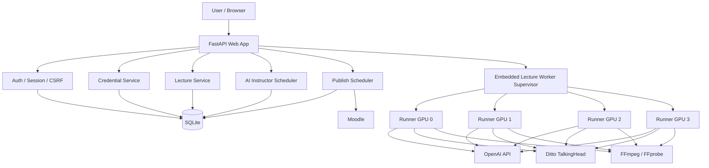

# AI Professor Lite

> **v0.4.7 · 1차 공개본**
>
> 현재 애플리케이션 버전은 `0.4.7`
>
> 현재 다른 서버에서도 같은 방식으로 실행할 수 있도록 Python/Conda 패키지와 설치 절차를 계속 정리하고 있습니다.  
> 특히 Ditto TalkingHead, CUDA, TensorRT, cuDNN 쪽은 GPU와 드라이버 구성에 따라 추가 설정이 필요할 수 있습니다.

AI Professor Lite는 강의 주제를 입력하면 강의안을 만들고, 슬라이드와 설명 음성을 생성한 뒤 교수 아바타 영상을 합성하고 Moodle까지 연결하는 강의 제작 시스템입니다.
> 현재 안내페이지 작성중입니다.

전체 흐름은 다음과 같습니다.

```text
강의 주제 입력
   ↓
강의안 / Quiz 생성
   ↓
슬라이드 / 이미지 생성
   ↓
TTS 음성 생성
   ↓
Ditto TalkingHead 아바타 영상 생성
   ↓
FFmpeg 최종 영상 합성
   ↓
Moodle VideoTracker 업로드 또는 예약 게시
```

현재 버전은 FastAPI, SQLite, OpenAI API, Ditto TalkingHead, FFmpeg, Moodle 연동으로 구성되어 있습니다. 작업이 길어지는 강의 생성 특성 때문에 단순 요청-응답 방식 대신 SQLite 기반 작업 큐와 GPU worker를 사용합니다.

---

## 먼저 보면 좋은 내용

처음 실행하는 경우에는 아래 순서로 보면 가장 빠릅니다.

1. [시스템 요구사항](#시스템-요구사항)
2. [설치](#설치)
3. [Ditto checkpoint 준비](#ditto-checkpoint-준비)
4. [환경 설정](#환경-설정)
5. [실행](#실행)
6. 문제가 있으면 [Troubleshooting](#troubleshooting)

프로젝트 구조나 worker 동작 방식이 궁금하다면 뒤쪽의 [구조와 동작 방식](#구조와-동작-방식)을 보면 됩니다.

---

# 주요 기능

## 강의 생성

강의 제목과 주제를 기준으로 강의 구조를 만들고, 슬라이드별 핵심 내용과 narration을 생성합니다.

현재 기본 기능은 다음과 같습니다.

- 30 / 40 / 50 / 60분 강의 구성
- 8~12장 슬라이드 생성
- 슬라이드별 핵심 bullet 생성
- 슬라이드별 narration 생성
- 4지선다 Quiz JSON 생성
- 선택적 AI 이미지 생성
- PowerPoint(`.pptx`) 생성
- 1920×1080 슬라이드 이미지 생성
- OpenAI TTS 기반 음성 생성
- Ditto TalkingHead 기반 교수 아바타 영상 생성
- FFmpeg 기반 최종 강의 영상 합성

강의 생성은 한 번에 끝까지 실행하는 방식이 아니라 stage 단위로 진행됩니다.

| Stage | Progress | 내용 |
|---|---:|---|
| `plan` | 10% | 강의 구성, narration, Quiz 생성 |
| `images` | 22% | 슬라이드용 이미지 생성 |
| `slides` | 42% | PPTX 및 슬라이드 PNG 생성 |
| `narration` | 50% | 슬라이드별 TTS 및 전체 음성 생성 |
| `timeline` | 65% | 슬라이드 영상 생성 |
| `avatar` | 73% | Ditto 아바타 영상 생성 |
| `compose` | 86% | 슬라이드 + 아바타 + 음성 합성 |
| `deploy` | 96% | Moodle 배포 또는 예약 게시 연결 |

각 stage 결과는 checkpoint로 남습니다. 중간에 worker가 종료되거나 애플리케이션이 재시작되더라도 완료된 stage가 정상인지 확인한 뒤 이어서 실행합니다.

---

## AI Instructor

AI Instructor는 학기 일정에 맞춰 강의를 미리 만들고, 지정된 시간에 Moodle에 게시하기 위한 기능입니다.

예를 들어 다음처럼 설정할 수 있습니다.

```text
학기 시작일: 2026-09-01
총 주차: 15주
게시 요일: 월 / 수
게시 시간: 18:00
Lead Time: 24시간
주당 생성 제한: 2회
대상 Course: 선택 Course
```

게시 예정 시간보다 `lead_hours`만큼 먼저 강의를 생성합니다. 영상 생성이 완료되면 바로 Moodle에 올리지 않고 예약 게시 상태로 둘 수 있으며, 게시 시간이 되면 publish scheduler가 업로드를 처리합니다.

기본 polling interval은 다음 환경변수로 조정할 수 있습니다.

```env
AI_INSTRUCTOR_POLL_SECONDS=60
AI_INSTRUCTOR_CATCHUP_GRACE_MINUTES=120
LECTURE_PUBLISH_POLL_SECONDS=30
```

서버가 게시 시점을 지나 재시작한 경우 `AI_INSTRUCTOR_CATCHUP_GRACE_MINUTES` 이내의 최근 슬롯은 늦게라도 계획할 수 있습니다. `0`으로 설정하면 catch-up을 비활성화합니다. AI Instructor를 비활성화하면 새 예약 생성만 중단되며, 이미 생성된 강의와 게시 예약은 자동 취소하지 않습니다.

---

## Moodle 연동

사용자는 웹 화면에서 본인의 Moodle URL과 Web Service Token을 등록할 수 있습니다.

현재 지원하는 동작은 다음과 같습니다.

- Course 조회
- Section 조회
- 기존 VideoTracker 조회
- 기존 VideoTracker에 영상 연결
- 새 VideoTracker activity 생성
- MP4 업로드
- 예약 게시

새 VideoTracker activity를 생성하려면 Moodle 쪽에 아래 custom external function이 필요합니다.

```text
mod_videotracker_create_activity
mod_videotracker_set_video
```

영상 업로드는 대략 아래 흐름으로 동작합니다.

```text
final_lecture.mp4
   ↓
Moodle /webservice/upload.php
   ↓
draftitemid
   ↓
mod_videotracker_set_video
   ↓
VideoTracker
```

비멱등적인 activity 생성 과정에서 응답이 불명확한 경우에는 같은 activity를 자동으로 다시 만들지 않습니다. 중복 생성 가능성을 줄이기 위해 해당 작업을 중단하도록 되어 있습니다.

---

# 시스템 요구사항

현재 worker는 `fcntl`, process group, `/proc`를 사용하므로 Linux 환경을 기준으로 합니다.

권장 환경은 다음과 같습니다.

```text
Linux x86_64
NVIDIA GPU
NVIDIA Driver
FFmpeg / FFprobe
Git LFS
Python 3.12 (Application)
Python 3.10 (Ditto)
```

Application과 Ditto는 Python 환경을 분리해서 사용하는 것을 권장합니다.

### Application

```text
Python 3.12
```

루트의 `requirements.txt`는 Application 환경용입니다.

### Ditto

Ditto upstream의 대표 테스트 환경은 다음과 같습니다.

```text
Python 3.10
TensorRT 8.6.1
A100
```

프로젝트의 `environment.yaml`도 Python 3.10 기반입니다.

Ditto가 다른 Python 환경에 설치되어 있다면 `DITTO_PYTHON`에 해당 interpreter 경로를 지정하면 됩니다.

---

# 설치

## 1. 저장소 받기

```bash
git clone <YOUR_REPOSITORY_URL> ai_prof_lite
cd ai_prof_lite
```

## 2. 시스템 패키지

Ubuntu 계열 기준 예시입니다.

```bash
sudo apt update
sudo apt install -y ffmpeg git git-lfs
git lfs install
```

## 3. Application 환경

```bash
python3.12 -m venv .venv
source .venv/bin/activate
python -m pip install --upgrade pip
python -m pip install -r requirements.txt
```

테스트까지 실행하려면 개발 의존성도 설치합니다.

```bash
python -m pip install -r requirements-dev.txt
```

## 4. Ditto 환경

Miniconda 또는 Miniforge가 설치되어 있다는 전제입니다.

```bash
conda env create -f environment.yaml
conda activate ditto
```

TensorRT 설치는 CUDA/cuDNN 조합에 영향을 많이 받습니다. 이미 정상 동작하는 서버가 있다면 해당 서버의 드라이버와 라이브러리 버전을 우선 기준으로 맞추는 편이 안전합니다.

---

# Ditto checkpoint 준비

Ditto checkpoint는 저장소에 포함하지 않습니다. 별도로 받아야 합니다.

```bash
cd core/ditto-talkinghead

git lfs install
git clone https://huggingface.co/digital-avatar/ditto-talkinghead checkpoints
```

기본 구성에서는 다음 경로를 사용합니다.

```text
core/ditto-talkinghead/checkpoints/
├── ditto_cfg/
│   ├── v0.4_hubert_cfg_trt.pkl
│   └── v0.4_hubert_cfg_trt_online.pkl
├── ditto_onnx/
├── ditto_pytorch/
└── ditto_trt_Ampere_Plus/
```

기본 설정은 Ampere Plus TensorRT engine을 사용합니다. GPU가 맞지 않는 경우 Ditto upstream의 변환 script로 현재 GPU에 맞는 engine을 생성해야 합니다.

예:

```bash
cd core/ditto-talkinghead

python scripts/cvt_onnx_to_trt.py \
  --onnx_dir ./checkpoints/ditto_onnx \
  --trt_dir ./checkpoints/ditto_trt_custom
```

이후 `.env`에서 경로를 변경합니다.

```env
DITTO_DATA_ROOT=core/ditto-talkinghead/checkpoints/ditto_trt_custom
```

---

# 환경 설정

저장소에는 실제 secret 대신 `.env.example`만 포함되어 있습니다.

처음 실행할 때 복사해서 사용합니다.

```bash
cp .env.example .env
```

`.env`에는 서버마다 다른 값이나 secret이 들어갑니다. 실제 운영에 필요한 값만 채우면 됩니다.

## 기본 Application 설정

```env
APP_ENV=development
APP_HOST=0.0.0.0
APP_PORT=8001
APP_RELOAD=0

DATA_DIR=data
DATABASE_PATH=./data/ai_prof_lite.db
TRUSTED_HOSTS=example.com,www.example.com
```

## Session / Credential 암호화 키

`SESSION_SECRET`은 충분히 긴 random 값을 사용합니다.

```bash
python -c 'import secrets; print(secrets.token_urlsafe(48))'
```

```env
SESSION_SECRET=<generated-secret>
```

Credential 암호화용 Fernet key는 다음처럼 생성할 수 있습니다.

```bash
python - <<'PY'
from cryptography.fernet import Fernet
print(Fernet.generate_key().decode())
PY
```

```env
CREDENTIAL_MASTER_KEY=<generated-fernet-key>
```

`CREDENTIAL_MASTER_KEY`가 바뀌면 기존 DB에 저장된 암호화 credential을 복호화할 수 없습니다. 운영 중에는 DB와 함께 별도로 보관해야 합니다.

## 회원가입

로그인/회원가입은 사용자별 OpenAI/Moodle 자격증명, 강의, 예약, 작업 이력을 분리하기 위해 유지합니다. 관리자 대시보드는 필요하지 않으며, 공개 가입을 제한하려면 공유 가입 코드를 설정할 수 있습니다.

```env
REGISTRATION_CODE=
```

값이 비어 있으면 일반 회원가입을 허용하고, 값이 있으면 가입 화면에서 해당 코드를 요구합니다. 가입 코드는 DB에 저장하지 않습니다.

## OpenAI

OpenAI 자격증명 정책은 설치자가 선택할 수 있습니다. 기본값은 사용자별 BYOK(`user`)입니다. 연구실/기관이 GPU 서버를 공용 자산으로 제공하면서 외부 종량제 API 사용량과 비용은 사용자별 키로 분리할 수 있습니다. 서버 공용 키를 사용할 설치 환경은 `server` 모드를 선택할 수 있습니다.

```env
OPENAI_KEY_MODE=user
SERVER_OPENAI_API_KEY=
OPENAI_TIMEOUT_SECONDS=120
```

- `OPENAI_KEY_MODE=user`: 각 계정이 API / 연결 설정에서 본인 OpenAI API Key를 등록합니다. 저장 전에 실제 API 연결 검증을 수행하며 실패한 키는 저장하지 않습니다.
- `OPENAI_KEY_MODE=server`: 서버의 `SERVER_OPENAI_API_KEY`를 모든 강의 작업에서 사용하며 개인 OpenAI Key 입력 UI는 숨깁니다.
- Moodle URL/Token은 모드와 관계없이 항상 사용자별 자격증명으로 유지합니다.

모델 관련 기본값은 다음과 같습니다.

```env

LECTURE_TEXT_MODEL=gpt-5.1
LECTURE_IMAGE_MODEL=gpt-image-2
LECTURE_TTS_MODEL=gpt-4o-mini-tts
LECTURE_TTS_VOICE=alloy

LECTURE_TARGET_DURATION_MINUTES=40
LECTURE_TARGET_SLIDE_COUNT=10
LECTURE_RENDER_SLIDES_WITH_IMAGE_MODEL=true
```

## GPU / Queue

기본값은 GPU 4개를 사용합니다.

```env
JOB_CONCURRENCY=4
MAX_RUNNING_JOBS_PER_USER=1
JOB_GPU_IDS=0,1,2,3

JOB_POLL_SECONDS=2
JOB_HEARTBEAT_SECONDS=10
JOB_LEASE_SECONDS=60
JOB_TIMEOUT_SECONDS=7200
JOB_MAX_ATTEMPTS=3
JOB_RETRY_SECONDS=10
```

`JOB_CONCURRENCY`는 서버 전체에서 동시에 실행할 수 있는 강의 job 수입니다. `MAX_RUNNING_JOBS_PER_USER`는 한 사용자가 동시에 점유할 수 있는 running job 수이며 기본값은 1입니다. queue 등록 자체는 제한하지 않습니다. 따라서 한 사용자가 여러 강의를 미리 등록해도 동시에 실행되는 수만 제한되고, 다른 사용자의 실행 슬롯을 독점하지 않습니다.

각 runner는 `JOB_GPU_IDS`의 GPU 하나에 고정됩니다. 같은 GPU에는 동시에 두 runner를 배정하지 않으며 GPU가 여러 개면 GPU 수/`JOB_CONCURRENCY` 범위에서 병렬 처리됩니다.

GPU가 1개라면 다음처럼 바꿉니다.

```env
JOB_CONCURRENCY=1
JOB_GPU_IDS=0
```

GPU가 2개라면:

```env
JOB_CONCURRENCY=2
JOB_GPU_IDS=0,1
```

## Ditto

```env
DITTO_ROOT=core/ditto-talkinghead
DITTO_DATA_ROOT=core/ditto-talkinghead/checkpoints/ditto_trt_Ampere_Plus
DITTO_CFG_PKL=core/ditto-talkinghead/checkpoints/ditto_cfg/v0.4_hubert_cfg_trt.pkl
DITTO_PYTHON=/opt/conda/envs/ditto/bin/python
```

멀티 GPU worker를 사용할 때는 보통 `DITTO_GPU`를 직접 지정하지 않습니다. GPU 할당은 worker가 `CUDA_VISIBLE_DEVICES`를 통해 처리합니다.

## Avatar

```env
AVATAR_INPUT_MODE=auto
AVATAR_CHROMA_COLOR=auto
AVATAR_CHROMA_SIMILARITY=0.12
AVATAR_CHROMA_BLEND=0.06
BACKGROUND_REMOVAL_REQUIRED=true
REMBG_MODEL=u2net_human_seg
```

업로드 제한 관련 기본값:

```env
MAX_PORTRAIT_BYTES=10485760
MAX_PORTRAIT_PIXELS=16000000

PORTRAIT_MAX_MB=10
PORTRAIT_MAX_PIXELS=20000000
PORTRAIT_MAX_SIDE=2048
```

## FFmpeg

```env
FFMPEG_BIN=ffmpeg
FFPROBE_BIN=ffprobe
MEDIA_PROCESS_TIMEOUT_SECONDS=3600
```

## Moodle

Moodle URL과 Web Service Token도 사용자가 UI에서 등록합니다. 저장 시 URL의 SSRF/DNS 정책을 검사한 뒤 `core_webservice_get_site_info` 호출로 실제 연결과 token 유효성을 확인합니다. 검증에 실패한 token은 저장하지 않습니다.

```env
MOODLE_VERIFY_SSL=true
MOODLE_TIMEOUT=120

MOODLE_ALLOWED_ORIGINS=
MOODLE_PRIVATE_ORIGINS=
ALLOW_PRIVATE_MOODLE_URLS=0
```

내부망 Moodle을 사용하는 경우에는 실제 환경에 맞게 private origin을 명시해야 합니다.

---

# 실행

Application 환경을 활성화합니다.

```bash
source .venv/bin/activate
```

설정과 외부 프로그램 경로를 먼저 확인하려면 preflight를 실행합니다.

```bash
python scripts/preflight.py
```

정상이면 서버를 시작합니다.

```bash
python app.py
```

기본 포트는 `8001`입니다.

```text
http://<server-ip>:8001
```

직접 Uvicorn으로 실행할 수도 있습니다.

```bash
uvicorn app:app --host 0.0.0.0 --port 8001
```

현재 구조에서는 `app.py`가 lecture worker supervisor까지 같이 시작합니다. 정상 운영 중에는 `python app.py`와 `python worker.py`를 동시에 실행하지 않습니다.

---

# Preflight

```bash
python scripts/preflight.py
```

현재 preflight는 다음 항목을 확인합니다.

- 필수 Python package import
- `ffmpeg`
- `ffprobe`
- `SESSION_SECRET`
- `CREDENTIAL_MASTER_KEY`
- Ditto `inference.py`
- Ditto model directory
- Ditto config file
- `DITTO_PYTHON` 경로

성공 시 다음과 비슷한 메시지가 나옵니다.

```text
OK: 필수 패키지, 설정 및 외부 실행 파일 경로 확인 완료
OpenAI/Moodle 연결, CUDA 및 Ditto 모델 실행 여부는 실제 환경에서 확인하세요.
```

CUDA runtime, TensorRT engine load, OpenAI/Moodle 실제 연결은 preflight만으로 확인하지 않습니다. 이 부분은 실제 실행 환경에서 smoke test가 필요합니다.

---

# 구조와 동작 방식

## 전체 아키텍처



애플리케이션 시작 시 DB schema 초기화, Moodle 예약 게시 scheduler, AI Instructor scheduler, lecture worker supervisor가 함께 시작됩니다.

## Worker와 작업 큐

강의 영상 생성은 시간이 오래 걸리고 GPU를 사용하기 때문에 SQLite 기반 durable job queue를 사용합니다.

기본 구성은 GPU 하나당 runner process 하나입니다.

```text
FastAPI
  └── Lecture Worker Supervisor
       ├── Runner #1 ── CUDA_VISIBLE_DEVICES=0
       ├── Runner #2 ── CUDA_VISIBLE_DEVICES=1
       ├── Runner #3 ── CUDA_VISIBLE_DEVICES=2
       └── Runner #4 ── CUDA_VISIBLE_DEVICES=3
```

`JOB_GPU_IDS`에는 CUDA index뿐 아니라 GPU UUID, MIG UUID도 사용할 수 있습니다.

동시 실행 수보다 GPU ID 수가 적으면 시작 단계에서 설정 오류로 처리합니다. GPU가 모두 사용 중이면 다음 작업은 queue에서 대기합니다.

## 작업 claim과 복구

여러 runner가 같은 작업을 가져가지 않도록 claim 시 SQLite `BEGIN IMMEDIATE` transaction을 사용합니다.

실행 중인 job은 lease 정보를 가집니다.

```text
running job
  ├── lease_token
  ├── lease_until
  ├── worker_id
  └── gpu_id
```

runner는 heartbeat를 갱신합니다. lease가 만료되면 해당 작업은 상태에 따라 재시도 또는 실패 처리됩니다.

lecture에는 현재 실행권한을 가진 `run_token`도 기록됩니다. 이전 worker가 늦게 종료되더라도 새 worker가 만든 결과를 덮어쓰지 못하도록 stale update를 차단하기 위한 값입니다.

애플리케이션이 비정상 종료된 뒤 다시 시작되면 supervisor는 이전 runner를 정리하고 unfinished job을 queue로 되돌립니다. 이후 checkpoint를 확인해서 첫 미완료 stage부터 다시 시작합니다.

checkpoint가 있더라도 실제 산출물이 없거나 0 byte라면 완료된 작업으로 보지 않습니다.

---

# Ditto와 교수 이미지 처리

이 프로젝트는 Ant Group의 Ditto TalkingHead를 교수 아바타 생성 엔진으로 사용합니다.

- Repository: <https://github.com/antgroup/ditto-talkinghead>
- Model: <https://huggingface.co/digital-avatar/ditto-talkinghead>
- Paper: <https://arxiv.org/abs/2411.19509>

교수 이미지는 Ditto에 바로 전달하지 않고 먼저 검증과 전처리를 거칩니다.

지원 형식은 PNG, JPEG, WebP입니다.

검증 과정에서는 MIME/실제 format 일치 여부, animated image, 비정상 이미지, pixel 수, 파일 크기 등을 확인합니다. EXIF orientation을 정리하고 metadata를 제거한 뒤 최종 PNG로 다시 저장합니다.

일반 portrait는 배경 제거 후 chroma canvas에 올리고, 이미 투명 배경이 있는 PNG는 alpha를 유지합니다. green/blue chroma 이미지가 이미 준비되어 있으면 이를 감지해서 그대로 사용할 수 있습니다.

최종 합성 시 FFmpeg chromakey를 적용합니다.

---

# 슬라이드와 영상 합성

슬라이드는 1920×1080 기준으로 생성합니다.

이미지는 비율을 강제로 늘리거나 무조건 crop하지 않고 원본 비율을 유지한 채 contain 방식으로 배치합니다. PPTX와 영상용 PNG 모두 같은 정책을 사용합니다.

TTS는 슬라이드별 WAV를 먼저 생성합니다.

```text
audio/
├── slide_001.wav
├── slide_002.wav
├── slide_003.wav
└── ...
```

이후 FFmpeg concat으로 전체 `narration.wav`를 만들고, 슬라이드 영상과 아바타 영상을 합성해 `final_lecture.mp4`를 생성합니다.

FFmpeg encoder는 이름만 확인하지 않고 실제 짧은 encode test를 수행한 뒤 선택합니다.

현재 우선순위는 다음과 같습니다.

```text
libx264
  ↓
h264_nvenc
  ↓
libopenh264
  ↓
mpeg4
```

---

# 보안 관련 구현

사용자 비밀번호는 Argon2로 hash합니다.

OpenAI API Key와 Moodle Token은 Fernet으로 암호화해 SQLite에 저장합니다. 암호화에 사용하는 `CREDENTIAL_MASTER_KEY` 자체는 DB에 저장하지 않습니다.

Session은 `SESSION_SECRET`을 사용하며, production 모드에서는 secure cookie와 HSTS를 활성화합니다.

```env
APP_ENV=production
```

상태를 변경하는 form은 CSRF token을 검증합니다.

Moodle URL은 서버에서 직접 요청하기 때문에 SSRF 방어도 포함되어 있습니다. URL을 normalize한 뒤 DNS resolve, IP 정책 검사, connection pinning을 거치며 redirect는 허용하지 않습니다.

내부 Moodle을 사용하는 경우에는 허용할 origin을 명시적으로 지정할 수 있습니다.

```env
MOODLE_PRIVATE_ORIGINS=http://10.0.0.10:8080
ALLOW_PRIVATE_MOODLE_URLS=1
```

---

# 데이터와 산출물

기본 DB 위치는 다음과 같습니다.

```text
data/ai_prof_lite.db
```

SQLite는 기본적으로 다음 설정을 사용합니다.

```text
PRAGMA foreign_keys = ON
PRAGMA journal_mode = WAL
PRAGMA busy_timeout = 5000
```

대표 table은 다음과 같습니다.

```text
users
user_profiles
organizations
organization_members
credentials
user_settings
lectures
lecture_jobs
lecture_stages
lecture_publish_schedules
```

강의 결과는 lecture와 `run_token` 기준으로 분리해서 저장합니다.

```text
data/lectures/<lecture_id>/runs/<run_token>/
├── lecture_plan.json
├── quiz.json
├── lecture.pptx
├── narration.wav
├── slides.mp4
├── avatar.mp4
├── final_lecture.mp4
├── images/
├── slides/
├── audio/
├── segments/
└── avatar_source/
```

이 구조 덕분에 이전 lease를 가진 worker와 새 worker가 같은 파일을 동시에 덮어쓰는 상황을 피할 수 있습니다.

---

# 프로젝트 구조

```text
ai_prof_lite/
├── app.py
├── worker.py
├── .env.example
├── requirements.txt
├── requirements-dev.txt
├── requirements-full.txt
├── environment.yaml
├── conda-requirements.txt
│
├── core/
│   ├── config.py
│   ├── version.py
│   ├── body_limit.py
│   ├── database/
│   ├── jobs/
│   ├── moodle/
│   ├── openai/
│   └── ditto-talkinghead/
│       ├── inference.py
│       ├── stream_pipeline_offline.py
│       ├── stream_pipeline_online.py
│       ├── core/
│       ├── scripts/
│       ├── example/
│       └── checkpoints/        # 별도 다운로드
│
├── modules/
│   ├── auth/
│   ├── credentials/
│   ├── dashboard/
│   ├── image/
│   ├── instructor/
│   ├── lecture/
│   ├── makeppt/
│   ├── moodle/
│   └── users/
│
├── templates/
├── static/
├── scripts/
├── tests/
└── data/                       # runtime data
```

---

# 테스트

개발 의존성을 설치한 뒤 실행합니다.

```bash
python -m pip install -r requirements-dev.txt
pytest tests
```

현재 test suite에는 GPU 설정, lecture pipeline, planner, SQLite queue, route 동작, security, slide rendering, worker 관련 regression/behavior test가 포함되어 있습니다.

Ditto upstream test와 애플리케이션 test를 섞지 않기 위해 프로젝트 root에서는 `pytest tests`처럼 애플리케이션 test directory를 지정하는 것을 권장합니다.

---

# Troubleshooting

## `CREDENTIAL_MASTER_KEY is not configured`

Fernet key가 설정되지 않은 경우입니다.

```bash
python - <<'PY'
from cryptography.fernet import Fernet
print(Fernet.generate_key().decode())
PY
```

생성된 값을 `.env`에 넣습니다.

```env
CREDENTIAL_MASTER_KEY=...
```

운영 중 key를 바꾸면 기존 credential을 복호화할 수 없습니다.

---

## Ditto checkpoint missing

다음 경로를 확인합니다.

```bash
ls core/ditto-talkinghead/inference.py
ls core/ditto-talkinghead/checkpoints/ditto_cfg/v0.4_hubert_cfg_trt.pkl
ls core/ditto-talkinghead/checkpoints/ditto_trt_Ampere_Plus
```

없다면 [Ditto checkpoint 준비](#ditto-checkpoint-준비)를 먼저 진행합니다.

---

## TensorRT 8.6.1 설치 문제

환경에 따라 NVIDIA package index가 필요할 수 있습니다.

```bash
python -m pip install \
  --extra-index-url https://pypi.nvidia.com \
  tensorrt==8.6.1
```

CUDA, TensorRT, cuDNN은 binary compatibility 영향을 많이 받습니다. 이미 정상 동작하는 서버의 조합이 있다면 해당 버전을 기준으로 맞추는 편이 좋습니다.

---

## `libcudnn.so.8`을 찾지 못함

일부 TensorRT 8.6.1 binary는 cuDNN 8 ABI를 요구할 수 있습니다.

예:

```bash
export LD_LIBRARY_PATH="$CONDA_PREFIX/cudnn8/nvidia/cudnn/lib:${LD_LIBRARY_PATH:-}"
```

서버별 CUDA/TensorRT/cuDNN 조합에 따라 해결 방법이 달라질 수 있습니다.

---

## TensorRT `cannot enable executable stack`

문제 library의 GNU_STACK 상태를 확인합니다.

```bash
readelf -l \
  "$CONDA_PREFIX/lib/python3.10/site-packages/tensorrt_libs/libnvinfer_builder_resource.so.8.6.1" \
  | grep GNU_STACK
```

TensorRT package를 다시 설치하면 기존 binary가 교체될 수 있으므로 같은 문제가 다시 나타날 수 있습니다.

---

## FFmpeg encoder 오류

사용 가능한 encoder를 확인합니다.

```bash
ffmpeg -encoders | grep -E '264|mpeg4'
```

NVENC 테스트:

```bash
ffmpeg -hide_banner -f lavfi -i color=s=320x240 -t 0.2 \
  -c:v h264_nvenc -f null -
```

---

## Moodle private URL 차단

내부망 Moodle을 사용한다면 허용 origin을 설정합니다.

```env
ALLOW_PRIVATE_MOODLE_URLS=1
MOODLE_PRIVATE_ORIGINS=http://10.0.0.10:8080
```

외부에 공개된 Moodle이라면 HTTPS URL 사용을 권장합니다.

---

## VideoTracker activity 생성 실패

Moodle 서버에 아래 custom external function이 등록되어 있는지 확인합니다.

```text
mod_videotracker_create_activity
mod_videotracker_set_video
```

사용 중인 Web Service Token에도 해당 function 호출 권한이 필요합니다.

---

## 앱 종료 후 runner가 남아 있는 경우

현재 runner를 확인합니다.

```bash
ps -ef | grep core.jobs.runner
```

정상 재시작에서는 supervisor가 같은 project root에서 실행된 이전 runner를 찾아 정리합니다.

---

# 운영 메모

운영 환경에서는 `APP_ENV=production`을 사용하고, Nginx/Caddy 같은 reverse proxy 뒤에서 HTTPS로 서비스하는 구성을 권장합니다.

```env
APP_ENV=production
```

SQLite backup은 WAL 상태를 고려해야 합니다. 가능하면 애플리케이션을 정상 종료한 뒤 복사하거나 SQLite backup API를 사용하는 편이 안전합니다.

`.env`, DB, 생성된 강의 파일, 사용자 업로드 파일은 서버별 runtime data이므로 소스 저장소와 분리해서 관리합니다.

---

# Third-party / License

## Ditto TalkingHead

AI Professor Lite는 Ant Group의 Ditto TalkingHead inference code/model을 사용합니다.

- GitHub: <https://github.com/antgroup/ditto-talkinghead>
- Project: <https://digital-avatar.github.io/ai/Ditto/>
- Model: <https://huggingface.co/digital-avatar/ditto-talkinghead>
- Paper: <https://arxiv.org/abs/2411.19509>

Ditto 관련 소스, 모델, checkpoint는 원 저작자와 upstream repository의 라이선스 조건을 따릅니다. 저장소에 포함된 `core/ditto-talkinghead/LICENSE`도 함께 확인해야 합니다.

AI Professor Lite 본체의 라이선스는 학교의 공식 라이선스 지정에 맞춰 별도로 정리할 예정입니다.

Ditto 논문 인용:

```bibtex
@article{li2024ditto,
    title={Ditto: Motion-Space Diffusion for Controllable Realtime Talking Head Synthesis},
    author={Li, Tianqi and Zheng, Ruobing and Yang, Minghui and Chen, Jingdong and Yang, Ming},
    journal={arXiv preprint arXiv:2411.19509},
    year={2024}
}
```

---

# 빠른 실행 요약

이미 설치와 설정이 끝난 서버라면 아래 세 줄이면 됩니다.

```bash
source .venv/bin/activate
python scripts/preflight.py
python app.py
```

브라우저에서:

```text
http://<server-ip>:8001
```

로 접속하면 됩니다.
