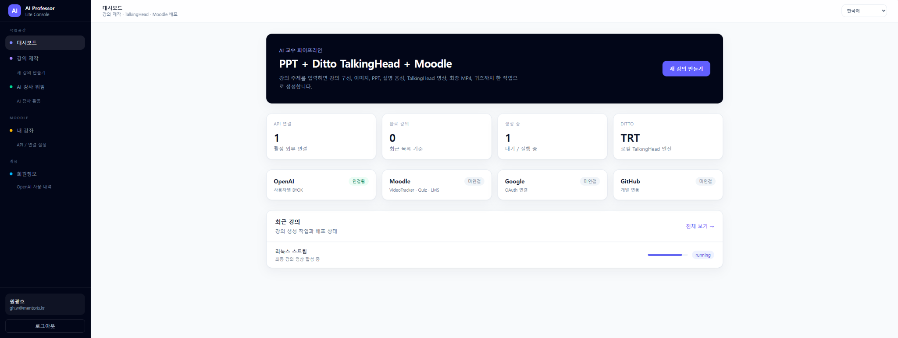
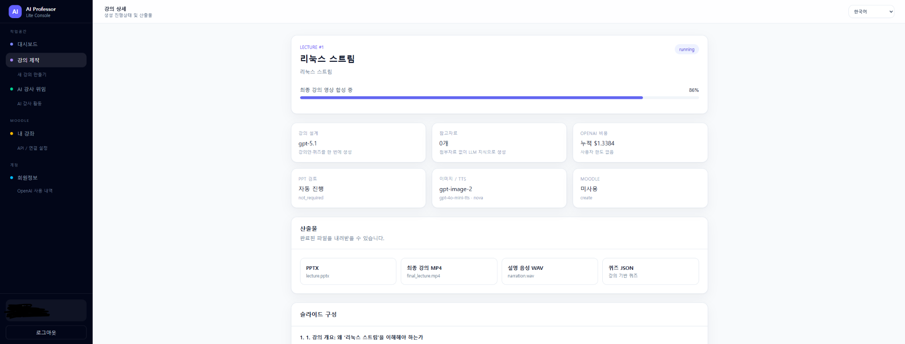
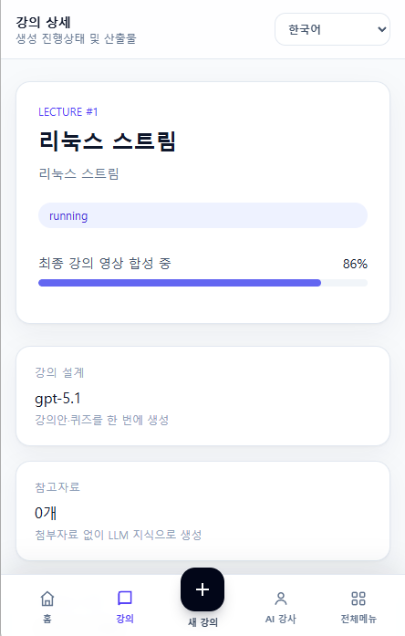
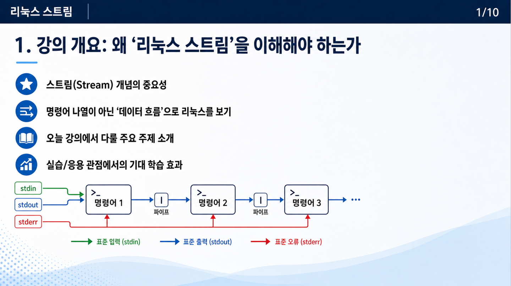
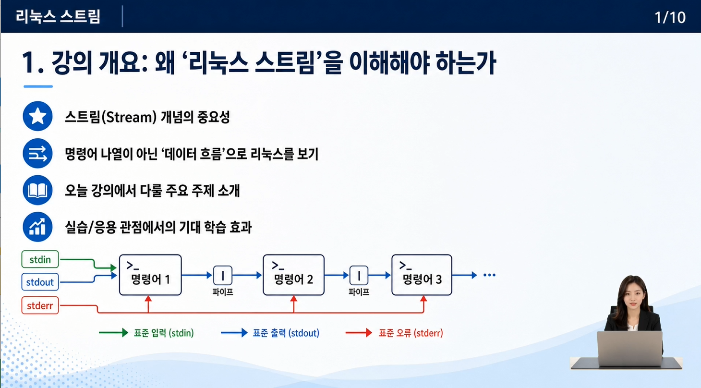

**한국어** | [English](./README_EN.md) | [日本語](./README_JA.md) | [中文](./README_ZH.md)

# AI Professor Lite

> Version `1.0.0`

AI Professor Lite는 강의 기획, 슬라이드, 음성, 교수 아바타 영상, 최종 MP4 제작과 Moodle 배포를 한 흐름으로 처리하는 self-hosted 강의 제작 애플리케이션입니다.

FastAPI 기반 웹 UI와 SQLite 작업 큐를 사용하며, 미디어 생성 작업은 GPU별 독립 runner에서 실행됩니다. OpenAI는 강의 구성, 이미지, TTS, 참고자료 RAG에 사용하고 Ditto TalkingHead는 교수 아바타 영상 생성에 사용합니다.


## 화면 및 생성 예시

대시보드에서 연결 상태, 생성 중인 강의, Ditto 엔진 상태와 최근 작업을 한눈에 확인할 수 있습니다.

<p align="center">
  
</p>

강의 상세 화면에서는 현재 생성 stage와 진행률을 확인하고, 완료 후 PPTX, 최종 강의 MP4, narration WAV, Quiz JSON 등의 산출물을 내려받을 수 있습니다. 데스크톱과 모바일 UI를 모두 지원합니다.

<table>
  <tr>
    <td width="72%"></td>
    <td width="28%"></td>
  </tr>
  <tr>
    <td align="center"><sub>데스크톱 강의 상세 / 생성 진행률</sub></td>
    <td align="center"><sub>모바일 강의 상세</sub></td>
  </tr>
</table>

### 실제 강의 영상 생성 흐름

AI Professor Lite는 생성된 PPT/슬라이드, TTS 음성(`narration.wav`), 교수 이미지를 기반으로 만든 Ditto TalkingHead를 FFmpeg로 합성하여 최종 강의 영상 `final_lecture.mp4`를 생성합니다.

<table>
  <tr>
    <td width="52%"></td>
    <td width="14%" align="center"></td>
    <td width="34%"></td>
  </tr>
  <tr>
    <td align="center"><sub>PPT / 생성된 강의 슬라이드</sub></td>
    <td align="center"><sub><code>narration.wav</code></sub></td>
    <td align="center"><sub>Ditto TalkingHead용 교수 이미지</sub></td>
  </tr>
</table>

<p align="center"><strong>PPT / 슬라이드 + 음성 + TalkingHead → <code>final_lecture.mp4</code></strong></p>

<p align="center">
  
</p>

<p align="center"><sub>실제 최종 강의 영상 프레임 예시 — 슬라이드와 TalkingHead가 하나의 영상으로 합성됩니다.</sub></p>


AI 교수 미리보기: [링크 준비 중]

무들 연동 플러그인: [링크 준비 중]

생성되는 영상 미리보기: https://ailms.k-university.ai/login/index.php

---

## 주요 기능

- 회원가입 / 로그인과 사용자별 데이터 분리
- 한국어 / 영어 / 일본어 / 중국어 UI
- 브라우저 언어 자동 감지 및 사용자 언어 고정
- OpenAI 사용자별 BYOK 또는 서버 공용 API Key
- PDF / TXT / Markdown / DOCX / PPTX 참고자료
- 참고자료 전체 입력 또는 embedding 기반 RAG
- 강의안, 슬라이드 구성, narration, Quiz 생성
- GPT Image 기반 슬라이드 이미지 생성
- PowerPoint(`.pptx`) 및 1920×1080 슬라이드 PNG 생성
- OpenAI TTS 기반 강의 음성 생성
- 목표 강의시간에 맞춘 narration 자동 보강
- Ditto TalkingHead 기반 교수 아바타 영상 생성
- 배경 제거 / chroma key 전처리
- FFmpeg 기반 최종 강의 MP4 합성
- PPT 검토 후 승인 / 수정 / 재개
- Moodle course / section / SimpleVideoTracker 연동
- AI Instructor 기반 학기 단위 자동 강의 생성 및 예약 게시
- SQLite lease queue, retry, heartbeat, checkpoint 복구
- 다중 GPU worker
- 사용자별 OpenAI 사용량 확인

---

## 요구사항

### Docker 설치

- Linux
- Docker Engine
- NVIDIA Driver
- NVIDIA Container Toolkit
- Git
- Git LFS
- OpenSSL
- NVIDIA GPU (Ampere 이상)

호스트에서 아래 두 명령이 정상 동작해야 합니다.

```bash
nvidia-smi
docker run --rm --gpus all nvidia/cuda:12.1.1-base-ubuntu22.04 nvidia-smi
```

### 수동 설치

- Linux / POSIX 환경
- Python 3.10
- FFmpeg / FFprobe
- NVIDIA GPU (Ampere 이상) + CUDA / TensorRT 환경
- SQLite

애플리케이션과 Ditto는 동일한 Python 3.10 환경에서 실행합니다.

---

## 빠른 시작

### Docker 설치

Docker 설치는 `setup.sh` 또는 `setup_en.sh`를 기준으로 합니다.

```bash
git clone https://github.com/hallym-aied/AI_Prof.git
cd ai_prof_lite

chmod +x setup.sh
./setup.sh
```

영문 설치 스크립트:

```bash
chmod +x setup_en.sh
./setup_en.sh
```

상세한 Docker 설치, 수동 설치, 환경변수, GPU/Worker 설정, 데이터와 보안, 문제 해결은 [`docs/INSTALLATION.md`](./docs/INSTALLATION.md)를 참고하세요.

---

## 최초 설정

1. 계정을 생성합니다.
2. 프로필에서 기본 언어를 선택합니다.
3. `API / 연결 설정`에서 OpenAI credential을 등록합니다.
4. Moodle을 사용할 경우 Moodle Web Service 정보를 등록합니다.
5. 새 강의를 만들고 필요하면 참고자료를 첨부합니다.
6. PPT 검토 단계에서 슬라이드를 확인한 뒤 승인합니다.
7. 생성 완료 후 PPTX, 영상, 음성, Quiz JSON 등의 결과물을 내려받습니다.
8. Moodle 연결이 설정되어 있으면 SimpleVideoTracker에 게시할 수 있습니다.

---

## 문서

- [설치 및 운영](./docs/INSTALLATION.md)
- [개발자 가이드](./docs/DEVELOPMENT.md)
- [기여하기](./CONTRIBUTING.md)

---

## Moodle

Moodle 연동은 사용자별 Web Service credential을 사용합니다.

지원 흐름:

- course 조회
- section 조회
- SimpleVideoTracker 조회
- 기존 activity에 영상 연결
- 새 SimpleVideoTracker activity 생성
- 강의 완료 후 즉시 게시
- AI Instructor 예약 게시

Moodle을 사용하지 않아도 강의 생성 기능은 동작합니다.

---

## AI Instructor

AI Instructor는 학기 일정에 맞춰 강의를 자동으로 기획하고 생성 작업을 예약하는 기능입니다.

주요 기능:

- 담당 Moodle course 선택
- 강의 일정 계산
- 교수 아바타 관리
- 예정 강의 자동 생성
- 실패 / 중단 상태 추적
- Moodle 예약 게시
- 서버 재시작 후 catch-up

복구 허용 시간:

```env
AI_INSTRUCTOR_CATCHUP_GRACE_MINUTES=120
```

---

## 지원

버그 및 기능 제안은 GitHub Issues를 이용해 주세요.

---

## 프로젝트 및 기여자

AI Professor Lite는 **학생들이 주도하여 개발한 오픈소스 프로젝트**입니다. 프로젝트의 개발 과정에는 기술 자문과 프로젝트 지원이 함께 이루어졌습니다.

### 현재 기여자

| GitHub | 역할 |
|---|---|
| [@Iamjunseok](https://github.com/Iamjunseok) | 개발자 / Collaborator |
| [@waitinghm-creator](https://github.com/waitinghm-creator) | 개발자 / Collaborator |
| [@hero707](https://github.com/hero707) | 기술 자문 / 프로젝트 지원 |
| [@hallymgitoslab](https://github.com/hallymgitoslab) | 프로젝트 지원 / Contributor |

---

## 지원 및 사사

본 과제(결과물)는 2026년도 교육부 및 강원특별자치도의 재원으로 강원앵커센터의 지원을 받아 수행된 지역성장 인재양성체계(앵커) 글로컬대학 30의 결과입니다.(2026-ANCHOR-10-009)


---

## 라이선스

Apache License 2.0. 라이선스 전문은 [`LICENSE`](./LICENSE)에 있습니다.
